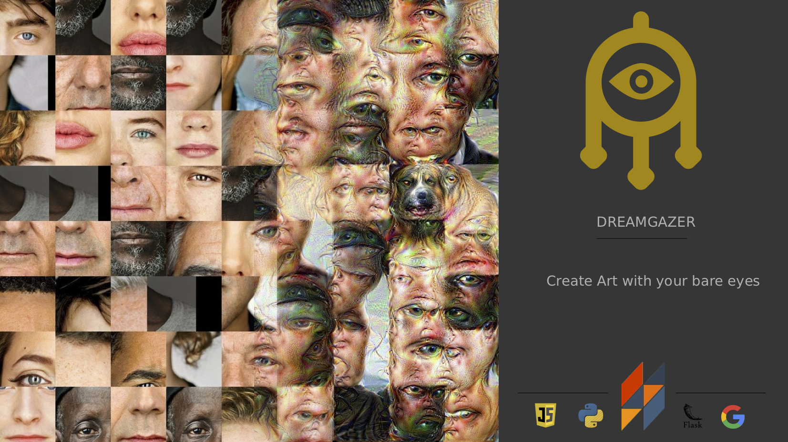

## Welcome to Dream Gazer

This project was created during AUHack 2018. Dream Glazer is an Art experiment: gaze at pictures and admire the uncanny outcome you just created.

## Why ?

Google's DeepDream neural network has been around for quite some time now. Although it creates fantastic psychedelic images, it still lacks the best part of human dreaming: the rapid eye movements during the so-called REM sleep. So why not combine human eye interaction with DeepDream somehow ?
Eye tracking seemed like an interesting and challenging thing to implement, and we wanted to hack something creative for our first hackathon. Combining Art with computers seemed like an exciting idea !

## How ?

We have used the [WebGazer.js](https://webgazer.cs.brown.edu/) open source library to handle the gaze tracking part. The web app communicates with a Python back-end using the [Flask](http://flask.pocoo.org/) micro-framework, which clusters the gaze coordinates for each image. The mean of those clusters allow us to determine regions where the user has been gazing the most, and we extract patches of the image around those mean vectors, in order to create a mosaic of all patches. The resulting mosaic is then fed into Google DeepDream to obtain a psychedelic and blended image.

### How to use it ?

The project needs some bug-fixing and polishing, but if you insist on testing it, you can run the python backend after installing [Flask](http://flask.pocoo.org/) in the *BackEnd* folder, and then a simple HTTP server in the *WebApp* folder. You will need to go through the calibration phase, which will only work properly if you carefully follow the cursor with your eyes, by going quite slowly, and by standing straight and close to your webcam, with as much light as possible.

### What next ?

This project will eventually be finished and improved as soon as the team has time for it :) 
Any help will be appreciated !
